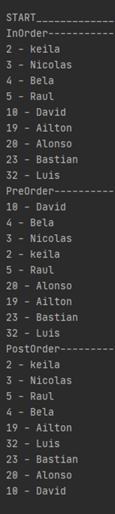
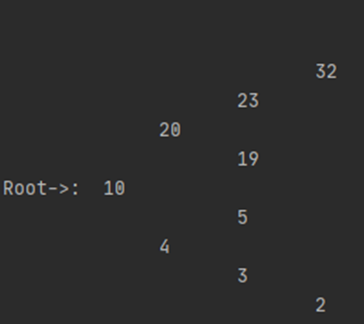

# Alumno: ____   _______

# Binary Search Tree for Person Structure

Aplicar el BST para gestionar personas, el cual tiene dos atributos: edad y nombre. Los registros deben ser insertados y organizados en el árbol en función de la edad. Imprimir las funciones PreOrder, InOrder, PostOrder. Además implementar una función que realice una impresión jerárquica del árbol.
Guiarse de las imágenes.

